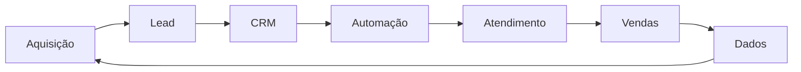

<div align="center">

# N8FLOW TECNOLOGIA

### Growth Marketing · Automação · IA · Dados · Tecnologia

**Construímos máquinas de vendas para negócios que querem crescer com processo, tecnologia e inteligência.**

[](https://n8flow.com.br)

</div>

---

## Sobre a N8FLOW

A **N8FLOW TECNOLOGIA** é uma empresa de **Growth Marketing e Tecnologia** que ajuda negócios a estruturar aquisição, relacionamento e vendas através da integração entre estratégia, processos e tecnologia.

Não entregamos ferramentas isoladas.

Construímos ecossistemas nos quais **marketing, vendas, CRM, automação, Inteligência Artificial e dados trabalham de forma integrada** para transformar oportunidades em processos comerciais mais previsíveis e escaláveis.

```text
Growth
  +
Marketing
  +
Dados
  +
Automação
  +
Inteligência Artificial
  +
CRM
  +
Processos Comerciais
  =
Máquina de Vendas
```

> **Mais que tecnologia. Construímos a máquina de vendas do seu negócio através de Engenharia de Growth, automação inteligente e gestão de relacionamento.**

---

## O que construímos

Nossa atuação conecta estratégia e implementação em quatro pilares.

### 🌐 Infraestrutura & Conversão

Construímos a infraestrutura digital necessária para aquisição e conversão.

* Sites institucionais
* Landing pages
* Funis de aquisição
* Experiências digitais orientadas à conversão
* Integrações entre plataformas

### ⚡ Automação & IA

Transformamos processos manuais em fluxos inteligentes e conectados.

* Automações com n8n
* Integrações via API
* Agentes de IA
* Automação de atendimento
* Workflows comerciais
* WhatsApp integrado

### 🤝 CRM & Relacionamento

Estruturamos processos para que oportunidades não se percam entre marketing e vendas.

* Implantação e integração de CRM
* Pipelines comerciais
* Qualificação de leads
* Automação de follow-up
* Agentes de atendimento
* Jornadas de relacionamento

### 📊 Growth, Tráfego & Dados

Utilizamos dados para conectar aquisição, comportamento e resultado comercial.

* Growth Marketing
* Gestão de tráfego
* Tracking de conversões
* Meta Conversions API
* Analytics
* Mensuração de funil
* Otimização orientada a dados

---

## Nosso modelo

A N8FLOW combina **educação, comunidade e implementação** dentro de um mesmo ecossistema.

```text
                    N8FLOW
                       │
                       ▼
              EDUCAÇÃO & EVENTOS
                       │
                       ▼
                   COMUNIDADE
                       │
                       ▼
             ASSESSORIA & TECNOLOGIA
```

### 🎓 Educação & Eventos

Conteúdo prático sobre Growth, Inteligência Artificial, CRM, automação, aquisição e vendas.

### 👥 Comunidade

Ambiente de aprendizado contínuo, networking, acompanhamento e aplicação.

### 🚀 Assessoria & Tecnologia

Diagnóstico, estratégia e implementação para empresas que precisam estruturar ou escalar sua máquina de vendas.

---

## Mercado

Nossa atuação está inicialmente concentrada no **mercado imobiliário**, conectando tecnologia e Growth aos desafios comerciais de:

* Corretores de imóveis
* Imobiliárias
* Incorporadoras

Para profissionais, criamos caminhos de **educação, comunidade e evolução digital**.

Para empresas, atuamos na estruturação de **aquisição, CRM, automação, atendimento, dados e processos comerciais**.

---

## Tecnologia

Tecnologia é parte da nossa infraestrutura — não o produto final.

Utilizamos diferentes ferramentas de acordo com o problema que precisa ser resolvido.

<div align="center">

### Desenvolvimento


### Dados & Infraestrutura


### Automação & IA


### Growth & Operação

`CRM` · `WhatsApp API` · `Analytics` · `Tracking` · `Conversions API` · `Webhooks` · `REST APIs`

</div>

---

## Projetos & Produtos

A N8FLOW também desenvolve produtos digitais próprios e soluções que funcionam como laboratórios de tecnologia, automação e experiência de produto.

| Projeto      | Descrição                                                                    | Tecnologias                   |
| ------------ | ---------------------------------------------------------------------------- | ----------------------------- |
| **JuriCRM**  | Plataforma SaaS multi-tenant para gestão e automação de operações jurídicas. | Next.js · Supabase · n8n      |
| **CicloPro** | Plataforma de planejamento e gestão de ciclos de estudo.                     | Next.js · TypeScript · Vercel |

> Nossos produtos ajudam a validar, na prática, arquiteturas, integrações e tecnologias utilizadas em nossas soluções.

---

## Como pensamos

```text
Estratégia
    ↓
Processo
    ↓
Tecnologia
    ↓
Automação
    ↓
Dados
    ↓
Otimização
```

Alguns princípios orientam nosso trabalho:

**Negócio antes da tecnologia.**
A ferramenta deve servir à estratégia — e não o contrário.

**Resultado antes da ferramenta.**
Não vendemos n8n, IA, CRM ou software isoladamente. Construímos soluções.

**Automação com processo.**
Automatizar um processo ruim apenas torna o problema mais rápido.

**Dados antes de opinião.**
Aquisição e vendas precisam ser mensuráveis.

**Integração antes de fragmentação.**
Marketing, atendimento e vendas devem fazer parte do mesmo sistema.

---

## Engenharia aplicada ao Growth

Acreditamos que uma operação comercial moderna deve funcionar como um sistema:



Cada interação gera dados.

Cada dado ajuda a melhorar o processo.

Cada processo pode ser otimizado.

Esse ciclo é o que transforma ferramentas isoladas em uma **máquina de vendas**.

---

## N8FLOW TECNOLOGIA

**N8FLOW TECNOLOGIA CONSULTORIA EM TI LTDA**
CNPJ: **68.352.519/0001-72**
Natal, Rio Grande do Norte 🇧🇷

🌐 [n8flow.com.br](https://n8flow.com.br)

---

<div align="center">

### Tecnologia que conecta. Growth que transforma.

**N8FLOW TECNOLOGIA**

Growth · Automação · Inteligência Artificial · Dados · Tecnologia

</div>
